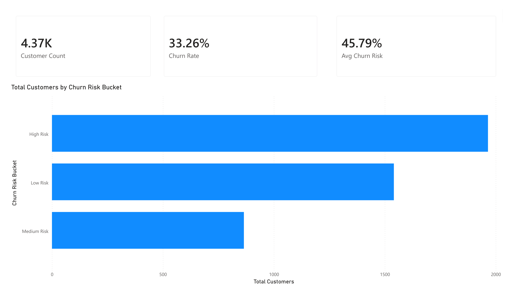
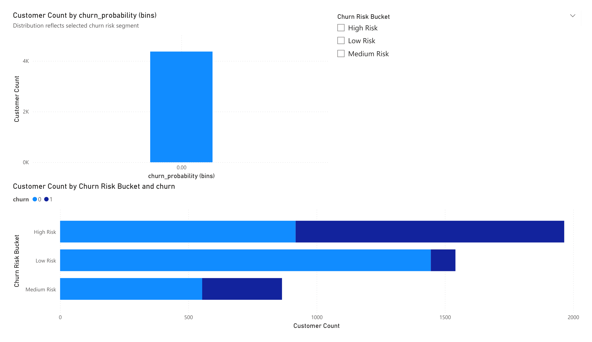
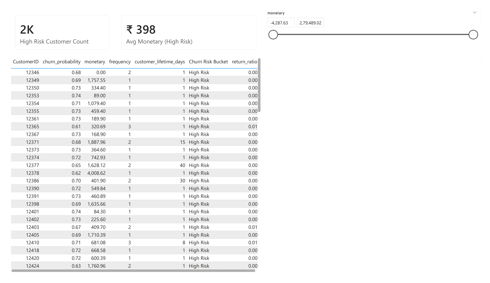

# 📉 Customer Churn Risk Analysis – E-Commerce

## 🔍 Project Summary

This project identifies **customers at risk of churn** using historical e-commerce transaction data and behavioral signals.

The objective is simple and business-driven:
**help teams proactively retain customers, reduce revenue loss, and prioritize high-risk users.**

The final deliverables include:

* A **customer-level churn risk scoring dataset**
* An **interactive Power BI dashboard** designed for business stakeholders

---

## 🧠 Business Context

Customer churn directly impacts revenue, marketing efficiency, and long-term growth.

Business teams typically struggle to answer:

* Which customers are likely to stop purchasing?
* What behavioral patterns signal churn risk?
* Who should be prioritized for retention campaigns?

This project addresses these questions by combining:

* Behavioral feature engineering
* Predictive churn modeling
* Business-oriented visual analytics

---

## 🗂 Dataset Overview

**Source:** Online Retail Transactional Dataset
**Time Period:** ~12 months
**Granularity:** Transaction-level
**Customers:** ~4,300 unique customers

### Raw Fields

* CustomerID
* InvoiceDate
* Quantity
* UnitPrice

### Engineered Customer-Level Features

* Purchase frequency
* Total monetary value
* Average basket value
* Recency (days since last purchase)
* Customer lifetime
* Purchase velocity
* Return ratio

---

## 🛠 Methodology

### 1️⃣ Data Cleaning & Preparation

* Removed cancelled and invalid invoices
* Filtered non-positive quantities and prices
* Created revenue features
* Aggregated transactions to customer-level metrics

---

### 2️⃣ Exploratory Data Analysis (EDA)

* Revenue concentration and customer contribution analysis
* Behavioral distribution of customers
* Identification of heavy vs light buyers
* Comparison of active vs churned customers

---

### 3️⃣ Churn Label Definition

Customers were labeled as **churned** if they made **no purchases in the last 90 days** of the observation window.

This reframes churn as a **binary classification problem** aligned with business expectations.

---

### 4️⃣ Feature Engineering

Key churn indicators engineered:

* Recency
* Purchase velocity
* Customer lifetime
* Return behavior
* Spending patterns

Special attention was paid to:

* Avoiding data leakage
* Handling division-by-zero cases
* Ensuring model stability and interpretability

---

### 5️⃣ Modeling & Scoring

Multiple models were evaluated.

**Logistic Regression** was selected because it provides:

* Strong predictive performance
* Clear interpretability
* Business-friendly coefficients

**Final Model Performance**

* Accuracy: ~98%
* ROC-AUC: ~0.99

Recency emerged as the **strongest churn predictor**.

The model outputs **churn probabilities** for every customer, enabling risk-based prioritization.

---

## 📊 Power BI Dashboard

An interactive Power BI dashboard was built using the churn scoring dataset.

### 🔹 Page 1 – Executive Overview


* Total customers
* Overall churn rate
* Active vs churned split
* High-level churn risk summary

### 🔹 Page 2 – Risk Distribution



* Customer segmentation by churn risk (Low / Medium / High)
* Behavioral comparisons across risk groups

### 🔹 Page 3 – High-Risk Customers



* List of high-risk customers
* Key behavioral indicators
* Actionable targets for retention campaigns

📌 Designed specifically for **decision-makers and marketing teams**, not just analysts.

---

## 🗂 Project Structure

```
customer-churn-risk-analysis/
│
├── dashboard/
│   ├── Customer_Churn_Risk_Dashboard.pbix
│   ├── Customer_Churn_Risk_Dashboard_e-commerce.pbix
│   └── screenshots/
│       ├── page1_executive_overview.png
│       ├── page2_risk_distribution.png
│       └── page3_high_risk_customers.png
│
├── data/
│   ├── raw/
│   │   └── online_retail_raw.csv
│   └── processed/
│       ├── cleaned_transactions.csv
│       ├── modeling_dataset.csv
│       └── churn_scoring_dataset.csv
│
├── Notebooks/
│   ├── 01_data_cleaning_eda.ipynb
│   ├── 02_customer_behavior_eda.ipynb
│   ├── 03_feature_engineering.ipynb
│   └── 04_modeling_scoring.ipynb
│
└── README.md
```

---

## 🧪 Tech Stack

* Python
* Pandas, NumPy
* Scikit-learn
* Logistic Regression
* Power BI
* Matplotlib, Seaborn

---

## 📌 Key Business Insights

* **Recency is the strongest churn signal**
* High-value customers can churn if engagement drops
* Churn risk is concentrated in a small customer segment
* Early detection enables targeted, cost-effective retention strategies

---

## 🔮 Future Improvements

* Combine churn probability with **Customer Lifetime Value (CLV)** to estimate revenue-at-risk
* Evaluate tree-based models with explainability (SHAP)
* Deploy churn scoring via **Streamlit**
* Add **uplift modeling** to measure campaign effectiveness

---

## 👤 Author

**Sampath**
Aspiring Data Scientist
Customer Analytics | Churn & CLV Modeling

---
