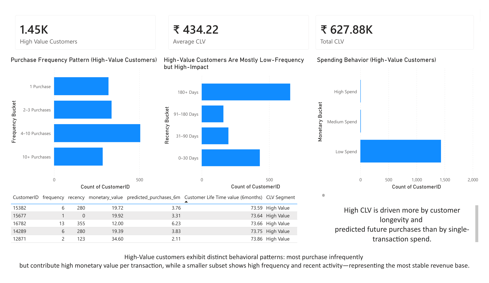
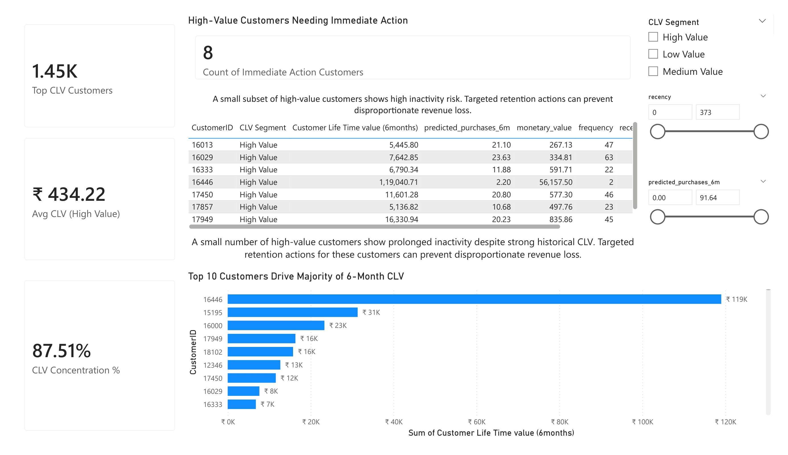

# 📈 Customer Lifetime Value (CLV) Analysis & Prediction 
# (E-Commerce)

## 📌 Project Overview

This project predicts **6-month Customer Lifetime Value (CLV)** for an e-commerce business using **probabilistic customer behavior models** and translates the results into **clear business actions** via Power BI dashboards and a Streamlit web app.

The focus is **decision-making**, not just prediction:

* Who are the most valuable customers?
* How concentrated is future revenue?
* Which high-value customers require immediate retention action?

---

## 🎯 Business Problem

Most businesses overspend on low-impact customers while under-protecting high-value ones.

This project addresses three core problems:

* Revenue concentration risk
* Customer prioritization
* Retention risk among high-value customers

---

## 🧠 Solution Approach

An end-to-end customer analytics pipeline was built:

1. Transaction-level data aggregation
2. Probabilistic customer behavior modeling
3. Forward-looking CLV prediction
4. Customer value segmentation
5. Business-facing dashboards and web deployment

---

## 📊 Dataset

* **Source:** E-commerce transactional data
* **Time Span:** ~12 months
* **Granularity:** Transaction-level → customer-level

### Core Fields

* CustomerID
* InvoiceDate
* Revenue

---

## 🔧 Feature Engineering

Customer-level features derived from purchase history:

| Feature        | Description                            |
| -------------- | -------------------------------------- |
| frequency      | Number of repeat purchases             |
| recency        | Time since last purchase               |
| T              | Customer age within observation window |
| monetary_value | Average revenue per transaction        |

These features align with **industry-standard CLV modeling assumptions** for non-contractual businesses.

---

## 📈 CLV Modeling

### 🔹 BG/NBD Model

* Predicts future purchase frequency
* Naturally handles customer inactivity
* Suitable for non-contractual retail settings

### 🔹 Gamma-Gamma Model

* Estimates expected transaction value
* Applied only to repeat customers

### 🔹 Final Outputs

* Expected purchases (next 6 months)
* Expected monetary value
* 6-month CLV estimate per customer

---

## 🧩 Customer Segmentation

Customers are segmented into:

* High Value
* Medium Value
* Low Value

This enables:

* Targeted retention strategies
* Efficient marketing spend
* Clear executive communication

---

## 🔍 Key Business Insights

* ~33% of customers contribute ~88% of projected 6-month CLV
* CLV is driven more by **repeat behavior and longevity** than single large purchases
* A subset of high-value customers shows inactivity risk, making them **top retention priorities**

---

## 📊 Power BI Dashboard

An interactive Power BI dashboard was designed for business stakeholders.

### Dashboard Pages

**Page 1 – CLV Overview**
.png)

* Total customers
* Average CLV
* Total projected CLV (6 months)
* CLV contribution by segment

**Page 2 – High-Value Customer Analysis**


* Purchase frequency patterns
* Recency behavior
* Spending distribution
* Customer-level CLV table

**Page 3 – Actionable Customers**


* High-value customers requiring immediate action
* Recency and predicted purchase filters
* Top CLV contributors

📁 `dashboard/`

---

## 🌐 Streamlit Application

A Streamlit app was built to make CLV insights accessible beyond BI tools.

### Features

* Multi-page navigation
* CLV-based segmentation filters
* Actionable customer tables
* Business-friendly KPIs

📁 `app/`

---

## 🗂 Project Structure

```
customer-lifetime-value-analysis/
│
├── data/
│   ├── raw/
│   │   └── online_retail_raw.csv
│   └── processed/
│       ├── clv_modeling_dataset.csv
│       └── clv_scoring_dataset.csv
│
├── notebooks/
│   ├── 01_clv_eda.ipynb
│   ├── 02_clv_feature_engineing.ipynb
│   └── 03_clv_modeling.ipynb
│
├── dashboard/
│   ├── CLV_Dashboard.pbix
│   └── screenshots/
│
├── app/
│   ├── app.py
│   ├── utils.py
│   └── pages/
│
├── requirements.txt
└── README.md
```

---

## 🛠 Tech Stack

* **Python:** Pandas, NumPy
* **Modeling:** Lifetimes (BG/NBD, Gamma-Gamma)
* **Visualization:** Power BI
* **Deployment:** Streamlit
* **Version Control:** Git & GitHub

---

## 🚀 Why This Project Matters

* Uses **industry-accepted CLV models**
* Focuses on **business impact**, not model vanity metrics
* Demonstrates analytics, modeling, visualization, and deployment
* Mirrors real-world customer analytics workflows

---

## 🔮 Future Enhancements

* Integrate churn probability with CLV for revenue-at-risk analysis
* Extend CLV horizon to 12 months
* Simulate campaign impact on future value
* Public Streamlit deployment

---
