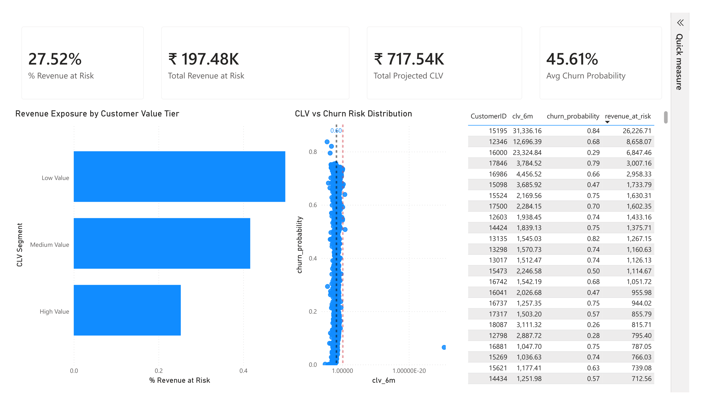

# 🟣 Revenue-at-Risk & Retention Prioritization (Integrated Executive Layer)

## 🔍 Business Problem

Predicting churn alone is not enough.
Predicting CLV alone is not enough.

The real business question is:

> How much future revenue is currently at risk — and where should retention efforts be focused?

---

## 🧠 Integration Logic

A unified customer-level dataset was created by combining:

* Churn probability (short-term disengagement risk)
* 6-month projected CLV (long-term revenue potential)

### Core Metric

[
Revenue\ at\ Risk = Churn\ Probability \times CLV_{6M}
]

This converts probabilistic churn predictions into **financial exposure estimates**.

---

## 📊 Executive Dashboard: Revenue at Risk

A standalone Power BI dashboard was built to provide executive-level retention intelligence.


### 🔹 KPI Overview

* Total Projected 6-Month CLV
* Total Revenue at Risk
* % Revenue Exposure
* Average Churn Probability

### 🔹 Strategic Visuals

* CLV vs Churn Probability scatter plot
* Revenue Exposure by Customer Value Tier
* Top Customers by Revenue at Risk

---

## 📌 Key Insight

Even when overall churn probability appears moderate, revenue exposure can be concentrated among high-value customers.

This dashboard enables:

* Financial risk quantification
* Targeted retention strategy
* Budget prioritization
* Executive-level decision support

---

## 🗂 Project Structure Update

```
customer-analytics-portfolio/
├── customer-churn-risk-analysis/
├── customer-lifetime-value-analysis/
├── customer-retention-intelligence/
│   ├── dashboard/
│   │   ├── Revenue_at_Risk_Executive_Dashboard.pbix
│   │   └── screenshots/
│   ├── data/
│   │   └── processed/
│   │       └── integrated_retention_dataset.csv
│   └── README.md
├── requirements.txt
└── README.md
```

---

## 🎯 Strategic Value of Integration

| Metric            | Operational View  | Financial View      |
| ----------------- | ----------------- | ------------------- |
| Churn Probability | Engagement Risk   | —                   |
| CLV               | Revenue Potential | —                   |
| Revenue at Risk   | —                 | Quantified Exposure |

This integration transforms predictive modeling into **actionable financial strategy**.

---
